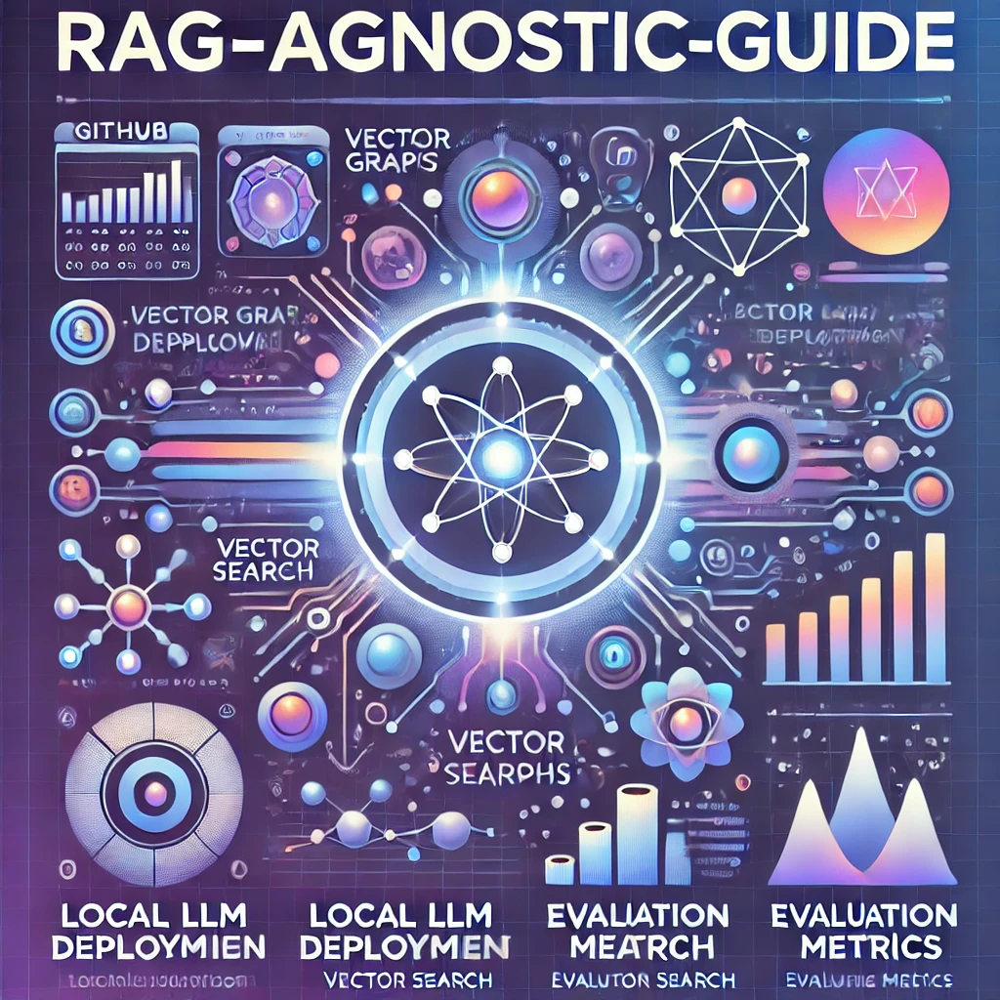

# RAG-Agnostic-Guide



A comprehensive guide and collection of examples for building production-ready Retrieval-Augmented Generation (RAG) systems using various open-source tools. This repository demonstrates different approaches to implementing RAG pipelines, from local LLM deployment to vector stores and evaluation frameworks.

## Key Features

- Multiple local LLM deployment options
- Vector store implementations and examples
- RAG evaluation frameworks and metrics
- Production-ready examples
- Comprehensive documentation for each component

## Repository Structure

### Local LLM Solutions
- **[Ollama](ollama/)** - Easy-to-use tool for running LLMs locally
- **[LocalAI](localai/)** - OpenAI-compatible API for local model deployment
- **[LMStudio](lmstudio/)** - Desktop application with user-friendly interface
- **[vLLM](vllm_inference/)** - High-performance inference engine with PagedAttention

### Vector Stores & Search
- **[Milvus Demo](milvus_demo/)** - E-commerce semantic search implementation
- **[OpenLit](openlit/)** - Fast inference engine with CUDA optimization

### RAG Components
- **[Basic RAG](ollama/basic_rag/)** - Simple RAG implementation example
- **[Resume Screener](resume_screener/)** - Practical RAG application for resume analysis

### Evaluation & Testing
- **[RAG Evaluator](rag_evaluator/)** - Tools and metrics for RAG evaluation
- **[DeepEval Demo](deepeval_demo/)** - Comprehensive RAG evaluation using DeepEval

## Getting Started

Each component has its own setup instructions in its respective directory. Generally, you'll need:

### Prerequisites
- Python 3.8+
- Conda (recommended) or pip
- GPU (optional, but recommended for better performance)

### General Setup
1. Clone the repository:
```bash
git clone https://github.com/yourusername/RAG-Agnostic-Guide.git
cd RAG-Agnostic-Guide
```

2. Choose a component and follow its specific setup instructions in the respective README.

## Documentation

Each component includes detailed documentation covering:
- Setup instructions
- Usage examples
- API references
- Performance considerations
- Best practices

## Contributing

Contributions are welcome! Please:
1. Fork the repository
2. Create a feature branch
3. Commit your changes
4. Push to the branch
5. Create a Pull Request

## License

This project is licensed under the MIT License - see the [LICENSE](LICENSE) file for details.

## Acknowledgments

Special thanks to all the open-source projects and their maintainers that make this guide possible:
- Ollama team
- LocalAI community
- LMStudio developers
- vLLM contributors
- Milvus community
- And many others!

For detailed information about specific components, please refer to their respective directories.